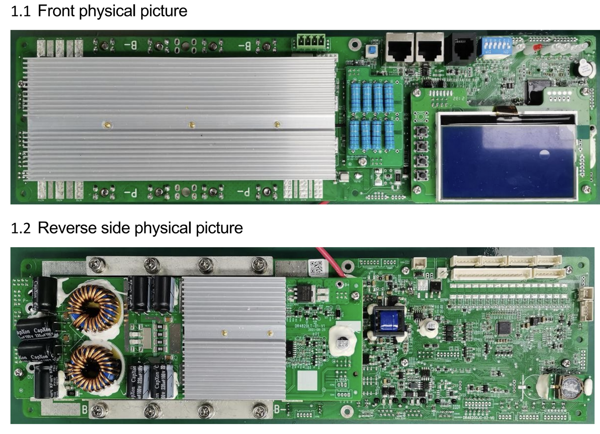
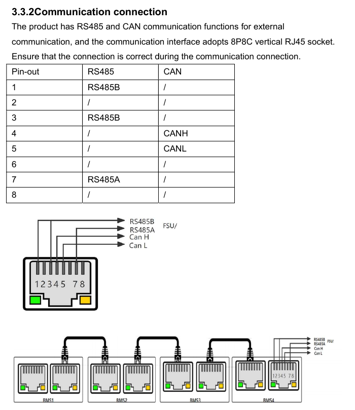

# daren-485
This is a research repository providing the results of getting RS485 communication to a Daren BMS to work (with Victron).

Since about a year I run a Victron-powered ESS setup, with 4 16S 48V 105Ah batterypacks from the usual place. The BMS in these packs uses both CAN and RS485 for communications. Adding a different brand of BMS caused the need to switch from CAN-based to RS485 comms, to be able to integrate both in the Victron setup.

TL;DR: dbus-serialbattery integration complete in mr-manuel's repo of [dbus-serialbattery](https://github.com/mr-manuel/venus-os_dbus-serialbattery). For manual installation see [Installation in dbus-serialbattery](#installation-in-dbus-serialbattery).

# The BMS

The BMS used in my batterypacks were marked "DR48100", "DR48100JC-03-V2", and "DR-JC03". It seems to be fairly commonly used in overseas batterypacks. It's supposed to be a "Daren" brand, but also the "Basen"-protocol spec perfectly matches this BMS.
The picture below is from a 200A-version, but mine looks just like it:

# Cause
RS485 is mainly used for interaction trough available BMS-software for Windows-PC, but also used for daisy-chaining the units. When you put one of the packs in 'master' mode (DIP 5/6), it actively sends out requests over the RS485 bus to query other (slave)packs. It combines the data and pushes it out the CAN-bus for integration with all kinds of inverters using various protocols.
Needless to say that hooking up these BMS on the CAN-bus is preferred, fairly trivial, well documented and almost plug and play with the Victron setup.

One of the great advantages of an 48v system to me was having the freedom to use the batterypack I like. One of the limitations in my setup currently, is that Victron does not support multiple BMS on CAN-bus, nor that the current CAN-based setup provided with cell-level statistics. So when I decided to add a different flavor of BMS, I had to fabricobble something of my own to get the Victron to communicate with the both of them. That's when I came across [dbus-serialbattery](https://github.com/mr-manuel/venus-os_dbus-serialbattery) (by [Louisvdw](https://github.com/Louisvdw/dbus-serialbattery) and [mr-manuel](https://github.com/mr-manuel) ). That allowed me to communicate with any BMS, as long as I would be able to build a driver for it, since it did not implement my BMS. Yet. Hence my research started. 
Given the lack of available information I decided to share my findings.

# Physical connections
As you can see in the picture above, the BMS has three interfaces; RS232 and two interfaces marked (CAN or RS485) and RS485. The two CAN/RS485 interfaces actually both contain RS485 pins, for daisy-chaining. See the picture below for pinout information. I used a basic USB to 485-adapter to connect one of the packs to my Victron setup.

> [!NOTE]
> I've found this to be one of the most common interfaces, but although the BMS protocol may be the same, your BMS interfacing may be different. Please double-check if it's suitable for your own!

# RS485 Protocol
The used protocol on the RS485 bus is developed according to the YD/T1363.1 specification. Using serial asynchronous communication with 8 databits, 1 start bit, 1 stop bit, no parity bit and a baudrate of 19200. It utilizes a master-slave concept, whereby slaves only respond to requests (from a master unit). The framework of this protocol is fairly commonly used. All packets base on start- and end-byte, version, address and command information. You can observe this protocol framework in all kinds of systems. This framework allows implementors to specify various commands and resultsets, what makes this implementation unique for this 'family' of BMS. I've attached two examples of the PYLON specifications, since it uses the same framework, only different implementations/functions: [RS485-protocol-pylon-low-voltage-V3.3-20180821.pdf](Docs/RS485-protocol-pylon-low-voltage-V3.3-20180821.pdf) and [PYLON-LFP-Battery-communication-protocol-RS485-V2.8-20161216.pdf](Docs/PYLON-LFP-Battery-communication-protocol-RS485-V2.8-20161216).

The basic structure of the dataframe is well described in [BMS-BASEN_Energy-Storage-protocol-En.pdf](Docs/BMS-BASEN_Energy-Storage-protocol-En.pdf), page 2. I'm not going to copy-paste everything from there, but I did find the document to the only fitting documentation of the actual protocol used in these BMS, although it is lacking information. The BMS-software clearly utilizes additional commands to get information this single described command is lacking. 
I've researched some of these additional commands/services that found of interest using a RS485-tap and used a decompiler to check the way the software interprets its responses. You can find the command and response description based on my notes below. The decompiler showed a bunch more services, but none of real interest. Also, a lot of services are available to configure the BMS. But since the BMS PC-software does that job just fine, that wasn't an area of interest.

The protocol uses formatting based on hexadecimal formatting(e.g. command 0x42 is literally sent as '42', or 0x34, 0x32). If you haven't yet read the BASEN BMS spec, see the structure of a dataframe below just to help in reading the dataframes further down:

| B# | Example Char | Description |
|---|-----|--------|
| 0 | `~` | SOI: Start Of Information (0x7E) |
| 1 | `22` | VER: Protocol Version Number (0x22) |
| 2 | `01` | ADR: Device Address (0-15 is valid), based on 4-digit DIP-switch (0x01-0x0F) |
| 3 | `4A` | CID1: Device Identification Code (0x4A) |
| 4 | `42` | CID2: Control Identification Code (Command Type) by master of Return Code (RTN) by slave) |
| 5/6 | `E002` | LENGTH: LENGTH byte contains 12-bit(LSB) length value of INFO length (0x0FFF) + 4bits(MSB) length-checksum(0xF000) |
| 7+ | `01` | INFO: Control Data Information(Command Info) by master of Response Data Message (DATA Info) by slave |
| last-4 | `FD28` | Checksum code (see BASEN document) |
| last | `␍ (\r)` | End Of Information: \r / CR (0x0D) |

Note that I've used a BMS configured with id/address 1, and all the commands used the same CID1 (device identification code) of 0x4A, so all commands and responses start with: `~22014A`.
All values are unsigned unless otherwise specified.

## Service 42
This is the most valuable service. Containing the majority of the runtime information. The service is called 'GetDeviceInfo' and retrieves things like voltages, current, temperatures, SOC, SOH, alarms, status information and capacity information. 

Request: `~22014A42E00201FD28␍`

Response: `~22014A00E0C6001A2C14C0100D010D010CDB0D010D010D000D020CE60CF80D020D010CDF0D020D020D000CE0010E0104010E040104010401040104000000000050011F4014F000CC000000000000000000230000000000000000000000000000000000000000000000D582␍`

### Request
The request is a basic request, only containing the 'Command Info' byte, which needs to match the ADR of the specific pack.
### Response
Like all dataframes, the response also starts with SOI(~), VER, ADR and CID1. But the slave returns an RTN code after that. See the BASEN document for all possible RTN codes. After the Length-bytes, the actual payload (DATA Info) is received. Data Info consists of the DATAFLAG byte, followed by the DATAI telemetry datastructure. The DATAI structure (described in the BASEN document) is not static, but depending on the number of cells in the pack, and the number of temperature sensors available. 
The modifier shows the operation needed to get the stored value to it's intended value. 

| Start B# | Data | Bytes | Modifier | Description | 
|---|-----|---|---|--------|
| 7 | `00` | `1` | - | DATAFLAG, bit0=Alarm change flag, bit4=Switch change flag |
| 8-9 | `1A2C (6700)` | `2` | `/100` | State of Charge (SOC) |
| 10-11 | `14C0 (5312)` | `2` | `/100` | Pack voltage |
| 12 | `10 (16)` | `1` | `/100` | Cell count (m), determines how much cell-voltages follow. |
| 13| `0D01 (3329)` | `2` | `/1000` | Voltage of cell 1 |
| 15 | `0D01 (3329)` | `2` | `/1000` | Voltage of cell 2 |
| 17 | `0CDB (3291)` | `2` | `/1000` | Voltage of cell 3 |
| 19 | `0D01 (3329)` | `2` | `/1000` | Voltage of cell 4 |
| 21 | `0D01 (3329)` | `2` | `/1000` | Voltage of cell 5 |
| 23 | `0D00 (3328)` | `2` | `/1000` | Voltage of cell 6 |
| 25 | `0D02 (3330)` | `2` | `/1000` | Voltage of cell 7 |
| 27 | `0CE6 (3302)` | `2` | `/1000` | Voltage of cell 8 |
| 29 | `0CF8 (3320)` | `2` | `/1000` | Voltage of cell 9 |
| 31 | `0D02 (3330)` | `2` | `/1000` | Voltage of cell 10 |
| 33 | `0D01 (3329)` | `2` | `/1000` | Voltage of cell 11 |
| 35 | `0CDF (3295)` | `2` | `/1000` | Voltage of cell 12 |
| 37 | `0D02 (3330)` | `2` | `/1000` | Voltage of cell 13 |
| 39 | `0D02 (3330)` | `2` | `/1000` | Voltage of cell 14 |
| 41 | `0D00 (3328)` | `2` | `/1000` | Voltage of cell 15 |
| 43 | `0CE0 (3296)` | `2` | `/1000` | Voltage of cell 16 |
| 45 | `010E (0270)` | `2` | `/10` | Ambient temperature (ENV_TEMP) in °C (signed int) |
| 47 | `0104 (0260)` | `2` | `/10` | Pack average temperature (pack_TEMP) in °C (signed int) |
| 49 | `010E (0270)` | `2` | `/10` | MOS temperature (MOS_TEMP) in °C (signed int) |
| 51 | `04 (04)` | `1` | - | TOT_TEMPs (n), determines how much cell-temperatures follow. |
| 52 | `0104 (0260)` | `2` | `/10` | Cell temperature 1 in °C (signed int) |
| 54 | `0104 (0260)` | `2` | `/10` | Cell temperature 1 in °C (signed int) |
| 56 | `0104 (0260)` | `2` | `/10` | Cell temperature 1 in °C (signed int) |
| 58 | `0104 (0260)` | `2` | `/10` | Cell temperature 1 in °C (signed int) |
| 60 | `0000 (0000)` | `2` | `/100` | Pack current (signed int) |
| 62 | `0000 (0000)` | `2` | `/10` | Pack Internal Resistance(pack_inter_RES) |
| 64 | `0050 (0080)` | `2` | - | State of Health (SOH) |
| 66 | `01 (01)` | `1` | - | User-defined number=13 (user_custom) |
| 67 | `1F40 (8000)` | `2` | `/100` | Full charge capacity in Ah |
| 69 | `14F0 (5360)` | `2` | `/100` | Remaining capacity in Ah |
| 71 | `00CC (204)` | `2` | - | Cycle count |
| 73 | `0000 (0000)` | `2` | - | voltage status: bit-based alarm and protection flags regarding under/over voltage ** |
| 75 | `0000 (0000)` | `2` | - | current status: bit-based alarm and protection flags regarding under/over current ** |
| 77 | `0000 (0000)` | `2` | - | temperature status: bit-based alarm and protection flags regarding under/over temperature ** |
| 79 | `0000 (0000)` | `2` | - | alarm status: bit-based status and warning flags ** |
| 81 | `0023 (35)` | `2` | - | FET status: bit-based FET status and warning flags ** |
| 83 | `0000 (0000)` | `2` | - | overvoltage protection status: bit-based FET status flags(LOW bits) ** |
| 85 | `0000 (0000)` | `2` | - | undervolt protection status: bit-based FET status flags(LOW bits) ** |
| 87 | `0000 (0000)` | `2` | - | overvoltage alarm status: bit-based FET status flags(LOW bits) ** |
| 89 | `0000 (0000)` | `2` | - | undervolt alarm status: bit-based FET status flags(LOW bits) ** |
| 91 | `0000 (0000)` | `2` | - | cell balance state: bit-based cell balance status flags(LOW bits) ** |
| 93 | `0000 (0000)` | `2` | - | cell balance state: bit-based cell balance status flags(HIGH bits) ** |
| 95 | `0000 (0000)` | `2` | - | overvoltage protection status: bit-based FET status flags(HIGH bits) ** |
| 97 | `0000 (0000)` | `2` | - | undervolt protection status: bit-based FET status flags(HIGH bits) ** |
| 99 | `0000 (0000)` | `2` | - | overvoltage alarm status: bit-based FET status flags(HIGH bits) *** |
| 101 | `0000 (0000)` | `2` | - | undervolt alarm status: bit-based FET status flags(HIGH bits) *** |
| 103 | `00 (00)` | `1` | - | Machine status list |
| 104 | `0000 (0000)` | `2` | - | IO status list |

**: See [BMS-BASEN_Energy-Storage-protocol-En.pdf](Docs/BMS-BASEN_Energy-Storage-protocol-En.pdf)
***: Since these were not documented in the BASEN pdf, see below 
(Note: untested! From decompiler. While in operation these were all 0.):

Machine status list (bit 0 = false, bit 1 = true):
| Bit # | Description |
| --- | ------ | 
| 0 | initialization |
| 1 | self_check |
| 2 | ready |
| 3 | DISCH |
| 4 | CHG |
| 5 | fail |
| 6 | power_off |
| 7 | factory_mode |

IO status list (bit 0 = false, bit 1 = true):
| Bit # | Description |
| --- | ------ | 
| 0 | charger_online |
| 1 | ACC_signal |
| 2 | ON_signal |
| 3 | aerosol_detection |
| 4 | batteryDischLocked |
| 5 | AntiTheftLocked |
| 6 | batteryChgLocked |
| 7 | n/a |
| 8 | pre_DISCH_MOS |
| 9 | n/a |
| 10 | n/a |
| 11 | n/a |
| 12 | crystal_oscillator_fail |
| 13 | EEP_fail |
| 14+ | n/a |

## Service 47
The service is called 'GetSystemParams' and retrieves system parameters like voltage, current and temperature limits, the number of cells and barcode information.

Request: `~22014A47E00201FD23␍`

Response: `~22014A006082000E4209C40073002D2EE00E4209C400102EE01F4005A00000FFFFFFFFFFFFFFFFFFFFFFFFFFFFFFFFFFFFFFFF444A4D3232303531383030363120202020202020E02C␍`

### Request
The request is a basic request, only containing the 'Command group' byte in the 'Command Info', which needs to match the ADR of the specific pack.
### Response
| Start B# | Data | Bytes | Modifier | Description | 
|---|-----|---|---|--------|
| 7 | `00` | `1` | - | DATAFLAG, undocumented |
| 8 | `0E42 (3650)` | `2` | `/1000` | cell_V_upper_limit |
| 10 | `09C4 (2500)` | `2` | `/1000` | cell_V_lower_limit |
| 12 | `0073 (115)` | `2` | `/1000` | upper_TEMP_limit |
| 14 | `002D (45)` | `2` | `/1000` | lower_TEMP_limit |
| 16 | `2EE0 (12000)` | `2` | `/1000` | upper_limit_of_CHG_C |
| 18 | `0E42 (3650)` | `2` | `/1000` | TOT_V_upper_limit |
| 20 | `09C4 (2500)` | `2` | `/1000` | TOT_V_lower_limit |
| 22 | `0010 (16)` | `2` | `/1000` | num_of_cells |
| 24 | `2EE0 (12000)` | `2` | `/1000` | CHG_C_limit |
| 26 | `1F40 (8000)` | `2` | `/1000` | design_capacity_none |
| 28 | `05A0 (1440)` | `2` | `/1000` | historical_data_storage_interval |
| 30 | `0000 (0000)` | `2` | - | balanced_mode |
| 31 | `FFFFFFFFFFFFFFFFFFFF FFFFFFFFFFFFFFFFFFFF` | `20` | - | product_barcode in ASCII string |
| 31 | `444A4D32323035313830 30363120202020202020` | `20` | - | BMS_barcode in ASCII string |

## Service 4F
This service is called when 'Get Protocol Version' is called. The service only returns the protocol version number.

Request: `~22014A4F0000FD8C␍`

Response: `~22014A00E002C8FD14␍`

### Request
The request is somewhat unusual, in that it does not contain any CommandInfo. Therefore it's length is empty, and so is the length checksum.
### Response
The only byte returned in this request is 0xC8 (200). 

## Service 51
Responsible for returning data upon 'Get Manufacturer Info' is called. Returns Hardware identification and software versions. The service is called 'GetDeviceManufacturerInfo'.

Request: `~22014A510000FDA0␍`

Response: `~22014A00604654315F472020202020204855414E593034202020313653313030412020200100020101EFB6␍`

### Request
The request is somewhat unusual, in that it does not contain any CommandInfo. Therefore it's length is empty, and so is the length checksum.
### Response
| Start B# | Data | Bytes | Modifier | Description | 
|---|-----|---|---|--------|
| 7 | `54315F47202020202020` | `10` | - | Hardware_type in ASCII string |
| 17 | `4855414E593034202020` | `10` | - | Product_code in ASCII string |
| 27 | `31365331303041202020` | `10` | - | Project_code in ASCII string |
| 37 | `010002` | `3` | - | Software version (noted in xx.xx.xx, in this case: 01.00.02) |
| 40 | `0101` | `1` | - | BOOT_version|

## Service 83
Service called when refreshing the "Clear the record" section in BMS software. Contains counters of overcharges and protections. The service is called 'OptWarningCnt'.

Request: `~22014A83C0040101FCC2␍`

Response: `~22014A00103C8301015A0007000100000000000000000000000000000000000000000000F224␍`

### Request
The request is a command-group request, containing the 'Command group' byte in the 'Command Info', which needs to match the ADR of the specific pack. It also has support for multiple operations, 0x01 being the 'Operation' observed when reading the data. Decompile shows support for 0x02, and two extra parameters, presumable for (re)setting the values. Due to lack of interest I've only documented the command which reads the data.
### Response
Since this command works with a command-group and multiple operations, the response also includes this as the first DATAI byte being the requesting CID2, and the second being the requested command. 

| Start B# | Data | Bytes | Modifier | Description | 
|---|-----|---|---|--------|
| 7 | `83` | `1` | - | Request CID2 |
| 8 | `01` | `1` | - | Request Operation |
| 9 | `015A (346)` | `2` | - | 'Number of overcharged PROT' (OCHG_PROT_Cnts) |
| 11 | `0007 (7)` | `2` | - | 'Number of times the PROT was placed' (ODISCH_PROT_Cnts) |
| 13 | `0001 (1)` | `2` | - | 'Number over over C PROT' (OC_PROT_Cnts) |
| 15 | `0000 (0)` | `2` | - | 'The number of TEMP prot' (TEMP_PROT_Cnts) |
| 17 | `0000 (0)` | `2` | - | 'Number of short-circuit PROT' (Short_circuit_PROT_Cnts) |
| 19 | `0000 (0)` | `2` | - | MOS_H_TEMP_PROT_Cnts |
| 21 | `0000 (0)` | `2` | - | ENV_H_TEMP_PROT_Cnts |
| 23 | `0000 (0)` | `2` | - | ENV_L_TEMP_PROT_Cnts |

## Service B0
Service B0 consists out of 4 different modules:
- 1: Module_OCV_param (Not tested yet, contains byte with flags ocvCfg.isEnable, ocvCfg.isDoItNow and all 2-byte uint variables: zero_point_C, CHG_C_coefficient, DISCH_C_coefficient, self_DISCH_rate, CAP_V_0/20/40/80/100, ratio_4_cycle, cell_full_CHG_V, cell_full_DISCH_V and check_RES_value).
- 2: Module_HW_PROT (Not tested yet, contains all 2-byte uint variables: HW_OC_PROT, HW_OC_PROT_delay, HW_SC_PROT, HW_SC_PROT_delay, HW_SC_PROT_release, HW_OV_PROT, HW_OV_PROT_delay, HW_UV_PROT and HW_UV_PROT_delay)
- 3: Module_MFG_params (Tested, see below. Contains manufacturer variables: packSn, productId, bmsId, bornData, and 'menufactury')
- 4: Module_CAP_params (Tested, see below. Contains capacity variables: remainingCap, fullChargeCap, designCap, totalChargeCap, totalDischargeCap, totalChargeKwh and totalDischargeKwh  )

### Module_MFG_params

Request: `~22014AB0600A010103FF00FB6C␍`

Response: `~22014A0040EEB0010103FF714A44324D30323135303836302031202020202020FFFFFFFFFFFFFFFFFFFFFFFFFFFFFFFFFFFFFFFFFFFFFFFFFFFFFFFFFFFFFFFFFFFFFFFFFFFFFFFFFFFFFFFFFFFFFFFFFFFFFFFFFFFFFFFFFFFFFFFFFFFFFFFFFFFFFFFFFFFFFFFFFFFFFFFFFFFFFFFFFFFFFFFFFFFFFFFFFFFFFFFF00C043␍`

### Request
Having multiple modules, this is a more lengthy command. Besides the default SOI, VER, ADR, CID1, CID2 and Length values, the requests consist out of a commandgroup, operation, module, functionid en functionlen parameter:

| Start B# | Data | Bytes | Modifier | Description | 
|---|-----|---|---|--------|
| 7 | `01` | `1` | - | CommandGroup (must match ADR, target device) |
| 8 | `01` | `1` | - | Operation (for multi-operation commands, such as getting and setting) |
| 9 | `03` | `1` | - | Module (for multi-module services, such as service B0) |
| 10 | `FF` | `1` | - | Function ID |
| 11 | `00` | `1` | - | Function LEN |

### Response
| Start B# | Data | Bytes | Modifier | Description | 
|---|-----|---|---|--------|
| 7 | `B0` | `1` | - | Request CID2 |
| 8 | `01` | `1` | - | CommandGroup |
| 9 | `01` | `1` | - | Operation (for multi-operation commands, such as getting and setting) |
| 10 | `03` | `1` | - | Module (for multi-module services, such as service B0) |
| 11 | `FF` | `1` | - | Function ID |
| 12 | `00` | `1` | - | Function LEN |
| 13 | `4A44324D303231353038 36302031202020202020 FFFFFFFFFFFFFFFFFFFF` | `30` | - | 'packSn' in ASCII string |
| 43 | `FFFFFFFFFFFFFFFFFFFF FFFFFFFFFFFFFFFFFFFF FFFFFFFFFFFFFFFFFFFF` | `30` | - | 'productId' in ASCII string |
| 73 | `FFFFFFFFFFFFFFFFFFFF FFFFFFFFFFFFFFFFFFFF FFFFFFFFFFFFFFFFFFFF` | `30` | - | 'bmsId' in ASCII string |
| 103 | `FFFFFF` | `3` | - | Borndata (read as three seperate bytes) |
| 106 | `FFFFFFFFFFFFFFFFFFFF FFFFFFFFFFFFFFFFFF00` | `20` | - | 'menufactory' in ASCII string |

### Module_CAP_params
Request: `~22014AB0600A010104FF00FB6B␍`

Response: `~22014A00D030B0010104FF0014F01F40271000003B87000036D044E139C3F38A␍`

### Request
Having multiple modules, this is a more lengthy command. Besides the default SOI, VER, ADR, CID1, CID2 and Length values, the requests consist out of a commandgroup, operation, module, functionid en functionlen parameter:

| Start B# | Data | Bytes | Modifier | Description | 
|---|-----|---|---|--------|
| 7 | `01` | `1` | - | CommandGroup (must match ADR, target device) |
| 8 | `01` | `1` | - | Operation (for multi-operation commands, such as getting and setting) |
| 9 | `04` | `1` | - | Module (for multi-module services, such as service B0) |
| 10 | `FF` | `1` | - | Function ID |
| 11 | `00` | `1` | - | Function LEN |

### Response
| Start B# | Data | Bytes | Modifier | Description | 
|---|-----|---|---|--------|
| 7 | `B0` | `1` | - | Request CID2 |
| 8 | `01` | `1` | - | CommandGroup |
| 9 | `01` | `1` | - | Operation (for multi-operation commands, such as getting and setting) |
| 10 | `04` | `1` | - | Module (for multi-module services, such as service B0) |
| 11 | `FF` | `1` | - | Function ID |
| 12 | `00` | `1` | - | Function LEN |
| 13 | `14F0 (5360)` | `2` | `/100` | 'remaining capacity AH' (remainingCap) |
| 15 | `1F40 (8000)` | `2` | `/100` | 'Full capacity AH' (fullChargeCap) |
| 17 | `14F0 (5360)` | `2` | `/100` | 'design capacity AH' (designCap) |
| 19 | `00003B87 (15239)` | `4` | `/100` | 'total charge capacity in AH' (totalChargeCap) |
| 23 | `000036D0 (14032)` | `4` | `/100` | 'total discharge capacity in AH' (totalChargeCap) |
| 27 | `44E1 (17633)` | `2` | `/100` | 'total charge KWH' (totalChargeKwh) |
| 29 | `39C3 (14787)` | `2` | `/100` | 'Total DISCH KWH' (totalDischargeKwh) |

# RS485 dbus-serialbattery interfacing in Victron
Using the RS485 interfaces in victron gives a bit of headache. When the system detects a RS485 adapter, it automagically spins up services capable of utilizing an RS485 connection. The thing is, these services all need to 'try' to find their device on that interface. All great if you have one or two things integrated, but when you have multiple systems connected it now takes a good amount of time for these checks to happen. More on this is described here: https://github.com/victronenergy/venus/wiki/howto-add-a-driver-to-Venus .

The USB-adapters I'm using are unique to my system, so I used the wikipage to add an entry in the serial-starter UDEV rules. But not to ignore it, but to dedicate it to the dbus-serialbattery instances I've been running: 

- Get the vendor and model ID of your interface using: `udevadm info --query=property --name=/dev/ttyUSB0`
- Remount the root partition using: `mount -o remount,rw /`
- Comment out any possible reference to a specific entry for your USB-adapter (using the same ID's) in `/etc/udev/rules.d/serial-starter.rules`
- Add this custom rule, containing your ID's to `/etc/udev/rules.d/serial-starter.rules`. Mark pinning the device to the 'sbattery' service.
`ACTION=="add", ENV{ID_BUS}=="usb", ENV{ID_VENDOR_ID}=="1a86", ENV{ID_MODEL_ID}=="7523", ENV{VE_SERVICE}="sbattery"`
- Since the dbus-serialbattery service is also booted up on all other rs485 interfaces, we don't want that either. So comment out the alias-rules from the file `/data/conf/serial-starter.d/dbus-serialbattery.conf`, preventing adding sbattery to the default rs485 service-definition of the serial-starter system.
- Reboot.

# Installation in dbus-serialbattery
The daren485 implementation is already integrated in the dbus-serialbattery repository of mr-manuel at https://github.com/mr-manuel/venus-os_dbus-serialbattery. If you're not yet on the latest release, and for legacy purposes, this is how you install this implementation in your running instance. 

- Download [daren_485.py](dbus-serialbattery/daren_485.py) and place in `/data/etc/dbus-serialbattery/bms`
- Add `from bms.daren_485 import Daren485` to the `import battery classes` section of the file `/data/etc/dbus-serialbattery/dbus-serialbattery.py` at line 23.
- Add `    {"bms": Daren485, "baud": 19200, "address": b"\x01"},` to the `supported_bms_types` array of the file `/data/etc/dbus-serialbattery/dbus-serialbattery.py` at line ~46(after edits). 
- Make sure you have added `Daren485` to the `BMS_TYPE=` var in your `/data/etc/dbus-serialbattery/config.ini`, when configured.
- When using multiple packs (and you're on mr-manual latest release, supporting multiple units on one bus!), also make sure you add their addresses to your `/data/etc/dbus-serialbattery/config.ini` as `MODBUS_ADDRESSES = 0x01, 0x02, 0x03, 0x04` (corresponding to the number of packs, and the dipswitches you set!).
- Call the reinstall-local script at: `/data/etc/dbus-serialbattery/reinstall-local.sh` 

> [!NOTE]
> The implementation is written for the current master-branch of the mr-manual repo of dbus-serialbattery (as of 02-08-2024). I've found that there is some rework going on and the versions of mr-manual and Louisvdw aren't fully aligned just yet. If you want to run this on the Louisvdw release, you need to change a few variables to the old names you can find in battery.py. Mainly the self.protection and self.history values don't align.

# Sources
I've found and used the following sources.

- The github repository: https://github.com/christian1980nrw/DR-JC03-RS485-Switcher containing a basic working of reading SOC, Voltage and Current. Created with the intention of switching a heating element.
- The github repository: https://github.com/LeoWinterDE/BMS containing various information in connecting the units trough CAN-bus, but also fairly recent firmware and instructions. Most importantly, it contained the most recent version (that I could find) of the BMS software, which i used to connect to the BMS. 
- The thread https://diysolarforum.com/threads/bms-hardware-version-dr-jc03.49898/, which pointed me to the fact my BMS was a "Daren" BMS and 
- The file [BMS-BASEN_Energy-Storage-protocol-En.pdf](Docs/BMS-BASEN_Energy-Storage-protocol-En.pdf), which I've found to match exactly with the protocol the BMS was using. 
- The thread https://diysolarforum.com/threads/bms-protocol-and-read-out.44389/ also contains useful and relevant information for this BMS.
